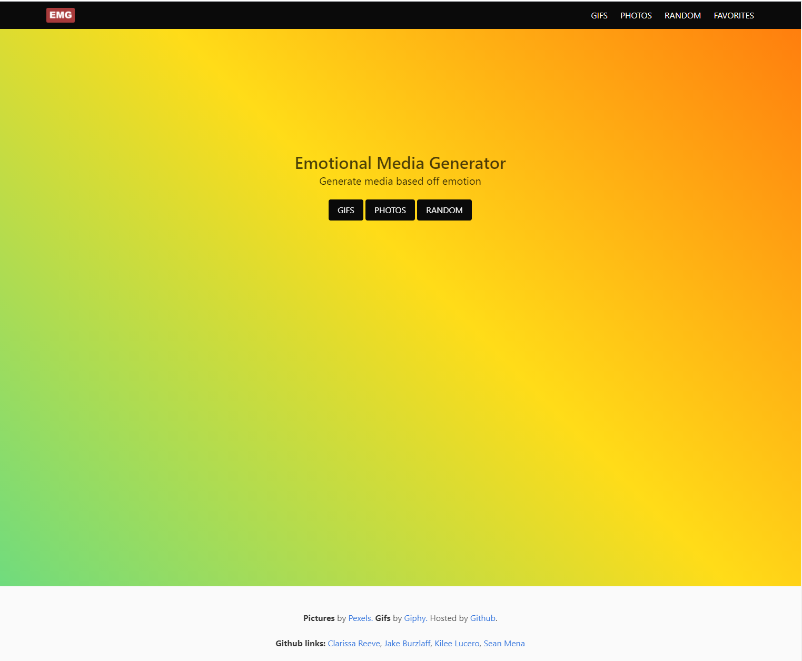

# Emotional_Media_Generator


Link to live site: [EMG](https://clarissareeve.github.io/Emotional_Media_Generator/)



## User Story

```
As a user, I would like to see photos or gifs based on an emotion, and be able to save the my favorites to look at later.
```

## User Experience

```
WHEN I load the page, it introduces the app and displays buttons for GIFS, PHOTOS and RANDOM selections.
WHEN the GIFS or PHOTOS button is selected,
THEN I am presented with a list of emotions to choose from.
WHEN I select an emotion,
THEN I am presented with 10 GIFS or PHOTOS.
WHEN I click on the Title,
THEN a new tab opens to the Pexels or Giphy website.
WHEN I click on the Heart Icon the image is added to FAVORITES.
WHEN I click on an emotion,
THEN I am presented with 10 more GIFS or PHOTOS.

WHEN I click on the logo in the navbar,
THEN the splash page is displayed.

WHEN I click on the FAVORITES in the navbar,
THEN I am presented with the images I have selected, OR a message that says I have not selected any favorites.
WHEN I click on the Heart Icon the image is removed from FAVORITES.
```

## Development Tools

Developed with:

* [Bulma](https://bulma.io/)
* [jQuery](https://jquery.com/)
* [Font Awesome](https://fontawesome.com/)

* [Giphy](https://developers.giphy.com/docs/api#quick-start-guide)
* [Pexels](https://www.pexels.com/api/documentation/)

## Features

* Local Storage
* AJAX

## Credits

This app was created by [Jake Burzlaff](https://github.com/jburz), [Clarissa](https://github.com/clarissareeve), [Sean Mena](https://github.com/seanmena) and [Kilee Lucero](https://github.com/kileelucero)

Logo by [Sean Mena](https://github.com/seanmena)